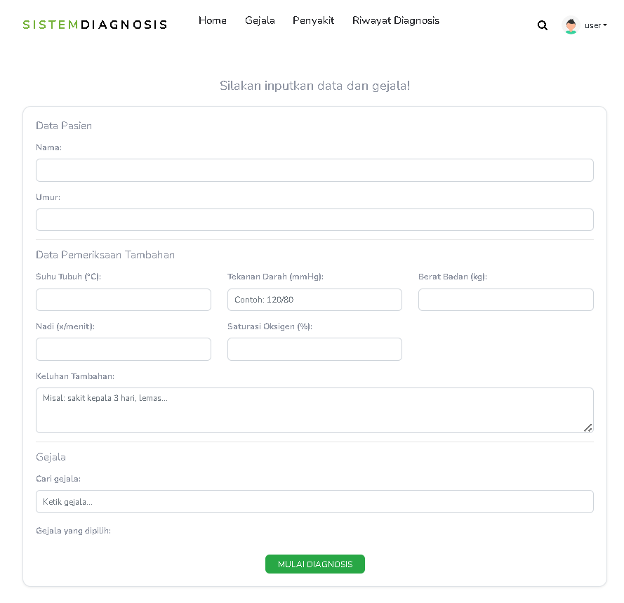

# 🩺 Sistem Diagnosa Penyakit

Aplikasi ini adalah sistem diagnosa berbasis web yang membantu pengguna 
untuk mengetahui kemungkinan penyakit berdasarkan gejala yang dipilih.

## 🛠️ Teknologi yang Digunakan
- Python
- Flask
- HTML, CSS
- Random Forest (Machine Learning)

## 🚀 Fitur Utama
- Login Admin
- Dashboard Admin
- Input Data Gejala
- Proses Diagnosa
- Menampilkan Hasil Diagnosa

## 📱 Tampilan Aplikasi

### 🔐 Halaman Login

Halaman untuk admin masuk ke sistem menggunakan username dan password.

---

### 📊 Dashboard Admin

Menampilkan ringkasan data dan menu utama pengelolaan sistem.

---

### 🧠 Halaman Diagnosis

Pengguna memilih gejala yang dialami untuk dilakukan proses diagnosa.

---

### 📋 Hasil Diagnosis

Menampilkan hasil perhitungan dan kemungkinan penyakit berdasarkan gejala yang dipilih.
